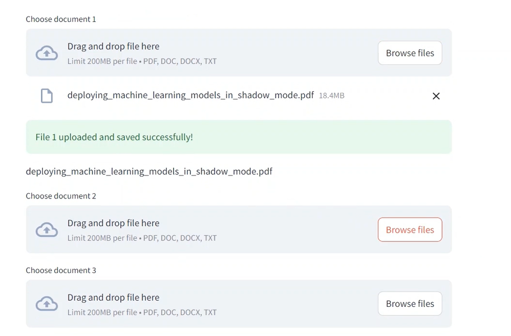
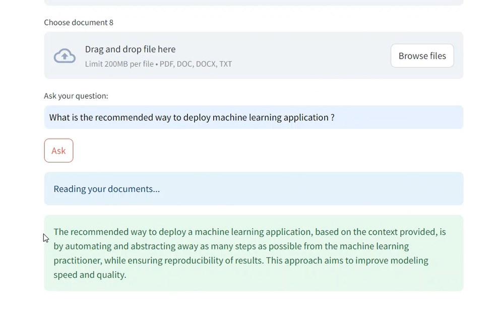

# octo-librarian
A streamlit RAG bapplication that uses IBM Granite for answering your questions from 8 documents

</img>

Very easy to run : 

First install all the requirements `pip install -r requirements.txt` 
Then add your IBM project ID and access key in .env file  
Finally, run the application : `streamlit run webapp.py` 

## Screenshots:

